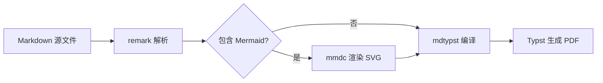
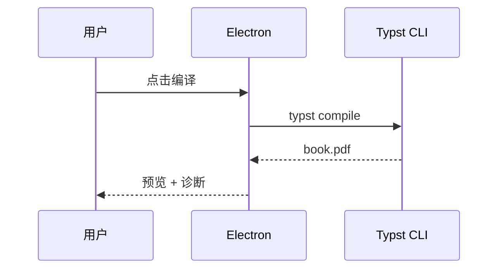

# 图表与工作流

## 架构图（Mermaid）



## 时序图



## 代码高亮（含中文注释与全角省略号）

```ts
// 编译入口：中文注释不应触发艺术字回退
const compile = async (book: Book) => {
  console.log(`编译 ${book.title} …`)
  return true
}
```

## 警告容器

:::warning
Typst 语法错误会在诊断面板显示，并映射回 Markdown 源文件行号。
:::

:::danger{title="破坏性操作"}
删除 build 目录会清空 Mermaid 缓存，首次编译将重新渲染。
:::
