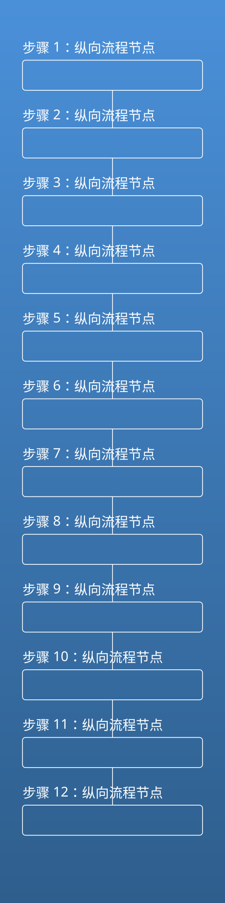

# 图片缩放与字体试金石

## 超高图片（600×2400）自动缩放

上图原始高度超过一页，应被等比缩小到单页可见，不截断、不分页。

## 字体试金石

- **粗体**：中文粗体应为 Noto Sans SC Bold，而非 Black 超粗
- *强调*：中文强调为半粗体（不出现楷体/艺术字）
- 常规文字与 `code 内中文注释` 的字体均应为 Noto Sans SC
- 西文 quick brown fox 0123 与中文混排，西文 0.85em

:::warning
本页用于验证字体回退不再命中系统艺术字体。
:::
